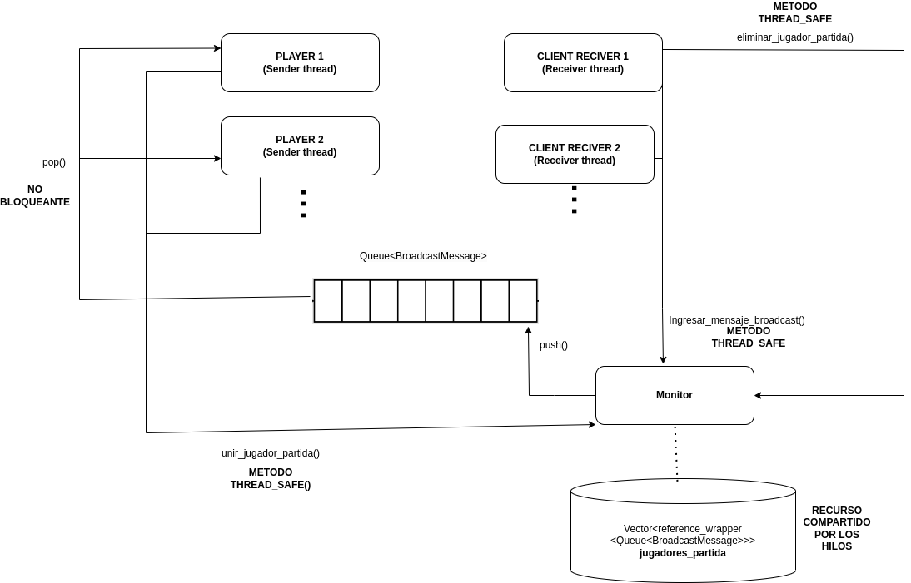

# Threads
Se utilizó std::lock_guard<std::mutex> lck(mutex_partida) en los metodos del monitor para evitar una race condition.
Se agrego un std::lock_guard<std::mutex> en el hilo recibidor para asegurarme que no haya condiciones de carrera a la 
hora de ingresar un nuevo mensaje al broadcast, asi como si se detecta que se cerro la conexion y se debe eliminar un jugador eliminando
del vector de colas, la cola del jugador, e imprimir los jugadores activos.
Por último parecio pertinente agregar en la clase game en el metodo unir_jugador_partida otro std::lock_guard<std::mutex> para
evitar una race condition, cada vez que se una un jugador a la partida.

 **DIAGRAMA THREADS**

